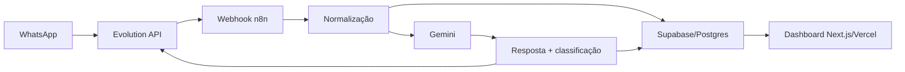

# Clínica Sorriso Prime - Agente IA WhatsApp

Solução completa para um teste técnico de Analista de IA e Automações. O projeto cria um agente de atendimento odontológico no WhatsApp usando Evolution API, n8n, Gemini, Supabase/Postgres e um dashboard web em Next.js.

## Arquitetura



## Stack

- n8n
- Evolution API
- Gemini API
- Supabase/Postgres
- Next.js
- TypeScript
- Tailwind CSS
- Recharts
- Vercel

## Estrutura

```txt
/
README.md
supabase/schema.sql
n8n/workflow-agente-whatsapp.json
n8n/instrucoes-n8n.md
dashboard/package.json
dashboard/src/app
dashboard/src/components
dashboard/src/lib
dashboard/src/types
docs/roteiro-video.md
docs/arquitetura.md
docs/vibe-coding-journal.md
```

## Como configurar o Supabase

1. Crie um projeto no Supabase.
2. Abra `SQL Editor`.
3. Execute o script `supabase/schema.sql`.
4. Confirme que as tabelas existem:
   - `conversations`
   - `messages`
   - `agent_events`
5. Copie:
   - Project URL
   - anon public key
   - service role key

O dashboard usa a anon key. O n8n usa a service role key.

## Como importar o workflow no n8n

1. Abra o n8n.
2. Importe `n8n/workflow-agente-whatsapp.json`.
3. Configure estas variáveis no ambiente do n8n:

```env
EVOLUTION_API_URL=https://sua-evolution-api.com
EVOLUTION_API_KEY=sua-chave-evolution
EVOLUTION_INSTANCE=sorriso-prime
GEMINI_API_KEY=sua-chave-gemini
SUPABASE_URL=https://seu-projeto.supabase.co
SUPABASE_SERVICE_ROLE_KEY=sua-service-role-key
```

4. Copie a URL de produção do node `Webhook Evolution API`.
5. Configure essa URL como webhook da Evolution API.
6. Ative o workflow.

## Como configurar a Evolution API

1. Crie ou conecte a instância do WhatsApp.
2. Use o mesmo nome em `EVOLUTION_INSTANCE`.
3. Configure o webhook apontando para o endpoint de produção do n8n.
4. Garanta que eventos de mensagens recebidas estejam habilitados.
5. Teste enviando uma mensagem para o número conectado.

## Como configurar o Gemini

1. Gere uma chave em Google AI Studio.
2. Configure `GEMINI_API_KEY` no n8n.
3. O workflow usa o modelo `gemini-1.5-flash` com resposta JSON.

## Como rodar o dashboard localmente

```bash
cd dashboard
npm install
cp .env.example .env.local
npm run dev
```

Edite `.env.local`:

```env
NEXT_PUBLIC_SUPABASE_URL=https://seu-projeto.supabase.co
NEXT_PUBLIC_SUPABASE_ANON_KEY=sua-chave-anon-publica
```

Acesse `http://localhost:3000/dashboard`.

## Deploy na Vercel

1. Suba o repositório para o GitHub.
2. Importe o projeto na Vercel.
3. Configure o diretório raiz do app como `dashboard`.
4. Adicione as variáveis:

```env
NEXT_PUBLIC_SUPABASE_URL=https://seu-projeto.supabase.co
NEXT_PUBLIC_SUPABASE_ANON_KEY=sua-chave-anon-publica
```

5. Faça o deploy.

## Regras do agente

- Responder de forma profissional, curta e humanizada.
- Se o cliente pedir preço, explicar que depende do procedimento e oferecer avaliação.
- Se pedir agendamento, pedir nome, melhor dia e horário.
- Se pedir humano, marcar `status = aguardando_humano`.
- Se encerrar conversa, marcar `status = encerrada`.
- Classificar intenção e sentimento.
- Se houver urgência, dor intensa ou reclamação, marcar `needs_human = true`.

## Prints esperados

Inclua no envio final:

- Workflow do n8n aberto.
- Execução bem-sucedida do n8n.
- Conversa real no WhatsApp.
- Tabelas do Supabase com registros.
- Dashboard `/dashboard`.
- Lista `/conversations`.
- Detalhe `/conversations/[id]`.
- Deploy na Vercel.

## Roteiro do vídeo

Use `docs/roteiro-video.md` para gravar uma apresentação de até 5 minutos.

## Vibe Coding Journal

O diário com prompts, decisões técnicas, erros comuns e correções está em `docs/vibe-coding-journal.md`.

## Commits sugeridos

1. `chore: setup inicial do projeto`
2. `feat: adiciona schema Supabase`
3. `feat: adiciona workflow n8n do agente WhatsApp`
4. `feat: cria dashboard base em Next.js`
5. `feat: adiciona metricas e graficos`
6. `feat: adiciona paginas de conversas`
7. `docs: completa README e documentacao`

## Checklist final para envio no WhatsApp

- [ ] Repositório GitHub público ou com acesso liberado.
- [ ] `supabase/schema.sql` executado no Supabase.
- [ ] Workflow importado e ativo no n8n.
- [ ] Evolution API conectada ao WhatsApp.
- [ ] Variáveis do n8n configuradas.
- [ ] Dashboard publicado na Vercel.
- [ ] Variáveis da Vercel configuradas.
- [ ] Teste real feito via WhatsApp.
- [ ] Supabase com conversas e mensagens reais.
- [ ] Prints salvos.
- [ ] Vídeo de até 5 minutos gravado.
- [ ] Link do GitHub, link da Vercel e vídeo prontos para envio.
