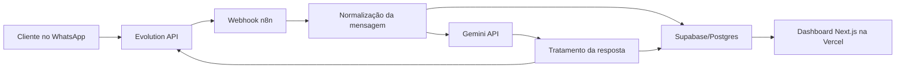

# Arquitetura

## Visão geral

## Componentes

- **Evolution API:** recebe e envia mensagens pelo WhatsApp.
- **n8n:** orquestra webhook, normalização, Supabase, Gemini, resposta e logs.
- **Gemini:** responde como atendente da Clínica Sorriso Prime e classifica intenção/sentimento.
- **Supabase/Postgres:** armazena conversas, mensagens e eventos do agente.
- **Dashboard Next.js:** exibe métricas reais, conversas, histórico e gráficos.
- **Vercel:** deploy do dashboard.

## Fluxo de dados

1. Cliente envia mensagem para o WhatsApp da clínica.
2. Evolution API dispara webhook para o n8n.
3. n8n extrai telefone, nome, conteúdo e tipo da mensagem.
4. n8n cria ou atualiza a conversa no Supabase.
5. n8n grava a mensagem inbound.
6. n8n chama Gemini com regras do atendente.
7. Gemini retorna JSON com resposta, intenção, sentimento, status e necessidade de humano.
8. n8n atualiza a conversa e grava mensagem outbound.
9. n8n envia resposta para o WhatsApp pela Evolution API.
10. Dashboard lê o Supabase em tempo real.

## Segurança

- A chave `SUPABASE_SERVICE_ROLE_KEY` fica somente no n8n.
- O dashboard usa `NEXT_PUBLIC_SUPABASE_ANON_KEY`.
- As tabelas têm RLS com políticas de leitura para o dashboard.
- Escritas operacionais são feitas pelo n8n usando service role.
